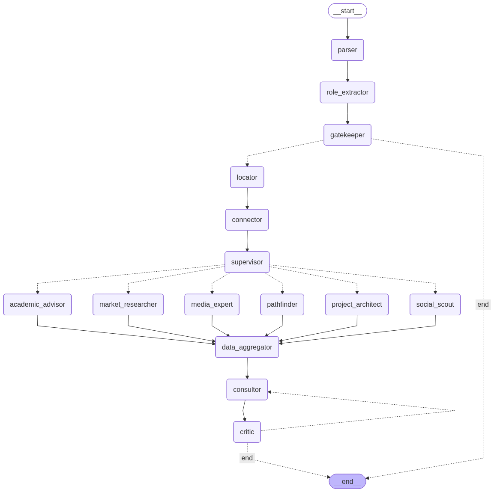

<div align="center">

# 🧭 CareerForge AI
### *Intelligent Career Transition Engine*

[](https://python.org)
[](https://langchain-ai.github.io/langgraph/)
[](https://neo4j.com)
[](https://deepmind.google/technologies/gemini/)
[](LICENSE)

**An AI-powered career strategist that helps professionals navigate complex career transitions using a 15-node multi-agent pipeline, Neo4j GraphRAG, live web intelligence, and Google Gemini 2.5.**

[Getting Started](#️-setup--installation) · [Architecture](#-architecture) · [Agent Pipeline](#-the-15-node-agent-pipeline) · [Tech Stack](#️-tech-stack)

</div>

---

## 🌟 What is CareerForge AI?

CareerForge AI is a **fully agentic, multi-source career guidance system** built for professionals who want to transition into high-growth tech roles. Whether you're a **teacher moving into Technical Writing**, a **researcher pivoting to Data Science**, or any professional looking to reinvent your career — CareerForge AI analyses your profile, identifies precise skill gaps, and synthesises a rich, personalised roadmap drawn from multiple live data sources.

Unlike generic career tools, CareerForge AI is grounded in:

- **O\*NET occupational data** — the gold standard for skills & task information in the US
- **Neo4j Knowledge Graph** — understands *how* jobs, skills, and market trends relate to each other
- **Live web intelligence** — real-time salary data, job market trends, networking communities, YouTube career videos, and top-rated courses, fetched fresh on every single query

The result: actionable, precise, and deeply contextual career guidance — at scale.

---

## 🚀 Key Features

### 🔗 Graph-RAG Architecture
Powered by **Neo4j**, CareerForge AI uses a Graph Retrieval-Augmented Generation approach. Instead of flat document retrieval, the system queries a rich knowledge graph of occupations, skills, and their interconnections — enabling far more contextual and accurate responses than traditional vector RAG systems.

### 🤖 15-Node Multi-Agent Parallel Workflow
The system is orchestrated by **LangGraph** and runs a pipeline of 15 specialised AI agent nodes. The key design breakthrough is the **Supervisor Fan-Out** architecture: after graph retrieval, a `Supervisor` node semantically analyses the user query and dynamically selects which of 6 specialist worker agents to activate — running them all in parallel — making every response uniquely tailored rather than templated.

### 🌐 Live Multi-Source Intelligence
CareerForge AI doesn't rely on static training data. Every query triggers live fetches from multiple sources running in parallel: salary and demand data via **Tavily Search**, career networking links from **Reddit & LinkedIn**, "Day in the Life" videos via the **YouTube Data API**, and top courses from **Coursera, Udemy & edX**.

### 📄 Resume-Aware Parsing
Users can upload their resume as a PDF. The `Parser` and `Role Extractor` agents jointly parse the document, extract current skills and roles, and fold that context into every downstream decision — enabling deeply personalised guidance without requiring the user to describe themselves from scratch.

### 🧩 Hybrid Retrieval
`hybrid_retriever.py` combines both **Cypher graph queries** and **vector similarity search**, giving the best of structured and semantic retrieval for highly relevant occupation matching.

### 🛡️ Quality-Gated Output
A dedicated `Critic` agent reviews every generated roadmap before it reaches the user. If the quality score falls below 7/10, the response is automatically routed back to `Consultor` for refinement — with a hard cap of 2 retry cycles to prevent runaway API usage.

---

## 🏗️ Architecture

The workflow below mirrors the actual LangGraph graph compiled in `orchestrator.py`. Solid arrows (`→`) are unconditional edges. Dashed arrows (`⤳`) are conditional edges decided at runtime.

```
                              ┌─────────────┐
                              │  __start__  │
                              └──────┬──────┘
                                     │
                                     ▼
                               ┌──────────┐
                               │  parser  │
                               └────┬─────┘
                                    │  Extracts raw text from the uploaded resume PDF
                                    ▼
                           ┌────────────────┐
                           │ role_extractor │
                           └───────┬────────┘
                                   │  Identifies current role, target role, career
                                   │  intent, and skills from query + resume text
                                   ▼
                            ┌────────────┐
                            │ gatekeeper │
                            └──────┬─────┘
                                   │  Validates input relevance
                    ┌──────────────┤
                    │ [off-topic / │ [valid]
                    │  unclear]    │
                    ▼              ▼
                 __end__      ┌─────────┐
                              │ locator │
                              └────┬────┘
                                   │  Semantic vector search — maps the described
                                   │  role to its closest O*NET occupation & SOC code
                                   ▼
                            ┌───────────┐
                            │ connector │
                            └─────┬─────┘
                                  │  Traverses the Neo4j knowledge graph using the
                                  │  matched SOC code; fetches occupation data,
                                  │  skill clusters, and task relationships
                                  ▼
                           ┌────────────┐
                           │ supervisor │
                           └──────┬─────┘
                                  │  Semantically analyses the query and dynamically
                                  │  decides which parallel workers to activate
                                  │
        ┌───────────┬─────────────┼──────────────┬──────────────┬──────────────┐
        │           │             │               │              │              │
        ▼           ▼             ▼               ▼              ▼              ▼
┌────────────┐ ┌───────────────┐ ┌─────────────┐ ┌───────────┐ ┌──────────────────┐ ┌──────────────────┐
│ pathfinder │ │market_research│ │ social_scout│ │media_expe-│ │academic_advisor  │ │project_architect │
│            │ │      er       │ │             │ │    rt     │ │                  │ │                  │
│ Runs Cypher│ │ Fetches live  │ │ Scrapes     │ │ Queries   │ │ Fetches top      │ │ Uses LLM to      │
│ gap query  │ │ salary ranges │ │ Reddit &    │ │ YouTube   │ │ courses from     │ │ brainstorm high- │
│ on Neo4j   │ │ & hiring      │ │ LinkedIn    │ │ Data API  │ │ Coursera, Udemy  │ │ signal portfolio │
│ to compute │ │ demand via    │ │ for real-   │ │ for "Day  │ │ & edX via Tavily │ │ project ideas    │
│ skill delta│ │ Tavily Search │ │ world       │ │ in the    │ │                  │ │ for the role     │
│ between    │ │               │ │ community   │ │ Life"     │ │                  │ │                  │
│ roles      │ │               │ │ links       │ │ videos    │ │                  │ │                  │
└─────┬──────┘ └───────┬───────┘ └──────┬──────┘ └─────┬─────┘ └────────┬─────────┘ └────────┬─────────┘
      │                │                │               │                │                    │
      └────────────────┴────────────────┴───────┬───────┴────────────────┘────────────────────┘
                                                │
                                                ▼
                                      ┌──────────────────┐
                                      │  data_aggregator │
                                      └────────┬─────────┘
                                               │  Synchronisation barrier — waits for all
                                               │  parallel workers and merges their outputs
                                               ▼
                                        ┌───────────┐  ◄─────────────────────────────────┐
                                        │ consultor │                                     │
                                        └─────┬─────┘                                     │
                                              │  Synthesises all data into a structured   │
                                              │  career roadmap: executive summary,        │
                                              │  skill gaps, resources & 30/60/90-day plan │
                                              ▼                                            │
                                         ┌────────┐                                        │
                                         │ critic │  ── scores output 0–10 ───────────────┘
                                         └────┬───┘     [score < 7 AND retries ≤ 2 → retry]
                              ┌───────────────┤
                              │  [score ≥ 7]  │  [score < 7,
                              │  OR retries   │   retries ≤ 2]
                              │  > 2          │
                              ▼              ⤳  consultor
                           __end__
```

### Routing Logic at a Glance

| Decision Point | Condition | Routes To |
|---|---|---|
| `gatekeeper` | Query is valid and role is known | `locator` |
| `gatekeeper` | Off-topic or current role unclear | `__end__` (immediate exit with explanation) |
| `supervisor` | Transition query with a target role | `pathfinder` + dynamic subset of other workers |
| `supervisor` | Market / exploration query only | Relevant subset (e.g. `market_researcher`, `academic_advisor`) |
| `critic` | Quality score ≥ 7 | `__end__` (response delivered) |
| `critic` | Score < 7, retry count ≤ 2 | `consultor` (regenerate with targeted feedback) |
| `critic` | Retry count > 2 | `__end__` (force exit, best available response delivered) |

---

## 🤖 The 15-Node Agent Pipeline

| # | Node | Symbol | Responsibility |
|---|------|--------|----------------|
| 1 | `parser` | 📄 | Reads the uploaded resume PDF and extracts raw text for downstream processing |
| 2 | `role_extractor` | 🧠 | Parses user query + resume text to identify current role, target role, career intent, and resume skills |
| 3 | `gatekeeper` | 🛡️ | Validates query relevance — blocks off-topic requests and asks for clarification when the current role is missing |
| 4 | `locator` | 📍 | Runs semantic vector search to map the user's described role to its closest O\*NET occupation and SOC code |
| 5 | `connector` | 🔗 | Traverses the Neo4j knowledge graph using the matched SOC code to fetch occupation data and related skill clusters |
| 6 | `supervisor` | 👔 | Analyses query semantics and dynamically selects which parallel worker agents to activate for this specific request |
| 7 | `pathfinder` | 🛤️ | Executes a Cypher gap query on Neo4j to compute the precise skill delta between the current and target occupations |
| 8 | `market_researcher` | 📈 | Fetches live salary ranges and hiring market demand for the target role via Tavily Search |
| 9 | `social_scout` | 🌐 | Scrapes Reddit and LinkedIn for real-world community links and career networking resources |
| 10 | `media_expert` | 🎥 | Queries the YouTube Data API for "Day in the Life" videos for the target role |
| 11 | `academic_advisor` | 🎓 | Fetches top-rated courses from Coursera, Udemy, and edX via Tavily Search |
| 12 | `project_architect` | 🏗️ | Uses the LLM to brainstorm high-signal, portfolio-worthy project ideas tailored to the target role |
| 13 | `data_aggregator` | 🔄 | Acts as a synchronisation barrier — collects and merges all parallel worker outputs before synthesis begins |
| 14 | `consultor` | 👼 | Synthesises all collected data into a structured career roadmap with executive summary, skill gaps, resource links, and a 30/60/90-day action plan |
| 15 | `critic` | 🧐 | Scores the generated roadmap 0–10 for accuracy, depth, and actionability. Routes back to `consultor` with targeted feedback if score < 7 (max 2 retries) |

---

## 🛠️ Tech Stack

| Layer | Technology | Purpose |
|-------|------------|---------|
| Orchestration | LangChain / LangGraph | Agent workflow, state management, and conditional routing |
| Database | Neo4j AuraDB | Knowledge graph storage + vector index |
| LLM | Google Gemini 2.5 Flash / Pro | Natural language reasoning across all 15 nodes |
| Data Source | O\*NET OnLine | Authoritative occupational skills & task data |
| Embeddings | Google Generative AI Embeddings | 768-dim semantic vector search |
| Web Intelligence | Tavily Search API | Live salary data, courses, and networking links |
| Video Search | YouTube Data API v3 | "Day in the Life" video sourcing |
| LLM Tracing | LangSmith | Observability and pipeline trace monitoring |
| Runtime | Python 3.13+ | Core application runtime |

---

## 📁 Project Structure

```
careerforge-ai/
├── config/
│   ├── prompts.yaml              # Legacy v1 prompts
│   ├── prompts_v2.yaml           # Active system prompts for all 15 agent nodes
│   └── settings.py               # Centralized project-wide configuration
│
├── data/
│   ├── raw/onet/                 # Raw O*NET source files
│   │   ├── Occupation Data.txt   # All occupations with SOC codes
│   │   ├── Skills.txt            # Skills mapped per occupation
│   │   └── Task Statements.txt   # Task-level descriptions per occupation
│   ├── processed/                # Cleaned and transformed data
│   └── schema/                   # Graph schema definitions
│
├── notebooks/
│   ├── 01_data_exploration.ipynb
│   ├── 02_graph_ingestion_test.ipynb
│   ├── 03_agent_prototyping.ipynb
│   └── 04_orchestrator.ipynb     # Full pipeline orchestration prototyping
│
├── src/
│   ├── agent2/                   # ✅ Active pipeline (15-node)
│   │   ├── nodes.py              # Business logic for all 15 agent nodes
│   │   ├── orchestrator.py       # LangGraph workflow definition & node wiring
│   │   └── state.py              # Shared graph state schema (TypedDict)
│   │
│   ├── agents/                   # Legacy v1 agent (archived)
│   │
│   ├── database/
│   │   └── neo4j_driver.py       # Neo4j connection, vector store & index setup
│   │
│   ├── ingestion/
│   │   ├── loader.py             # Parses & cleans O*NET raw text files
│   │   └── vectorizer.py         # Generates and stores occupation embeddings
│   │
│   ├── retrieval/
│   │   ├── hybrid_retriever.py   # Combines vector + Cypher graph retrieval
│   │   ├── simple_retriever.py   # Standalone Cypher & vector search logic
│   │   └── text2cypher.py        # Converts natural language to Cypher queries
│   │
│   ├── tools/
│   │   ├── formatting.py         # Output formatting utilities (links, skill gaps)
│   │   ├── resume_engine.py      # PDF resume parser
│   │   └── search_engine.py      # Tavily & YouTube API wrappers
│   │
│   └── utils/
│       ├── helpers.py            # Shared utilities and prompt loading
│       └── llms.py               # LLM & embedding model initializations
│
├── tests/
│   ├── test_agents.py            # Unit tests for agent nodes
│   └── test_graph.py             # Integration tests for the full workflow
│
├── run_chat.py                   # CLI entry point (legacy v1)
├── run_chat2.py                  # 🚀 CLI entry point — use this for the v2 pipeline
├── run_ingestion.py              # 📥 Populates the Neo4j knowledge graph
├── test_setup.py                 # Verifies environment & connections
├── requirements.txt
└── .env                          # API keys (not committed to version control)
```

---

## ⚙️ Setup & Installation

### Prerequisites

Before getting started, have the following ready:

- A **[Neo4j Aura](https://neo4j.com/cloud/platform/aura-graph-database/)** instance — the Free Tier is sufficient
- A **[Google AI Studio](https://aistudio.google.com/)** API Key for Gemini access
- A **[Tavily](https://tavily.com/)** API Key for live web search
- A **[YouTube Data API v3](https://console.cloud.google.com/)** Key
- A **[LangSmith](https://smith.langchain.com/)** API Key *(optional — for pipeline tracing)*
- **Python 3.13+** installed on your machine

### 1. Clone the Repository

```bash
git clone https://github.com/vishwajit0509/onet-neo4j-langchain-poc.git
cd careerforge-ai
```

### 2. Create a Virtual Environment

```bash
python -m venv venv

# Linux/macOS
source venv/bin/activate

# Windows
venv\Scripts\activate
```

### 3. Install Dependencies

```bash
pip install -r requirements.txt
```

### 4. Configure Environment Variables

Create a `.env` file in the project root:

```env
# Google Gemini
GOOGLE_API_KEY="your_gemini_api_key"

# Neo4j AuraDB
NEO4J_URI="neo4j+ssc://your-instance.databases.neo4j.io"
NEO4J_USERNAME="your_username"
NEO4J_PASSWORD="your_password"
NEO4J_DATABASE="your_database"

# Tavily — live web search
TAVILY_API_KEY="tvly-..."

# YouTube Data API v3
YOUTUBE_API_KEY="AIza..."

# LangSmith — optional, for tracing
LANGCHAIN_TRACING_V2="true"
LANGCHAIN_API_KEY="lsv2_pt_..."
LANGCHAIN_PROJECT="CareerForge-AI"
```

### 5. Verify Your Setup

```bash
python test_setup.py
```

This confirms Neo4j connectivity, Gemini API access, and all environment variables before you proceed.

---

## 🏃 How to Run

### Phase 1 — Data Ingestion *(Run Once)*

Populate the Neo4j knowledge graph with O\*NET data. This is a one-time setup step:

```bash
python run_ingestion.py
```

This script will:
- Parse and clean occupation, skills, and task data from `data/raw/onet/`
- Generate 768-dim vector embeddings for each occupation using Gemini Embeddings
- Create `Occupation` and `Skill` nodes in Neo4j
- Build `REQUIRES` relationships between occupations and their skills, weighted by proficiency level
- Initialise the Neo4j Vector Index for semantic search

> ⏱️ Ingestion may take a few minutes depending on data size and API response times.

### Phase 2 — Start a Career Consultation

Once ingestion is complete, launch the interactive CLI:

```bash
python run_chat2.py
```

You will be prompted to enter your current role, your target career, and optionally a path to your resume PDF. The 15-node pipeline will then:

1. Parse your resume and extract skills and role context
2. Map your current role to the O\*NET taxonomy via semantic search
3. Traverse the knowledge graph to fetch rich occupation data
4. Dynamically activate the right specialist agents in parallel
5. Fetch live salary, course, video, and networking data simultaneously
6. Synthesise everything into a personalised, structured career roadmap
7. Self-review and refine the output via the Critic before returning it to you


## 🛡️ API Usage & Rate Limit Notes

CareerForge AI makes multiple sequential and parallel LLM calls per query due to its multi-node architecture. If you're using the **Gemini Free Tier** (15–20 RPM), you may occasionally see `429 Resource Exhausted` errors.

The following mitigations are already built in:

- **Automatic Rate Limiting** — Deliberate delays between node transitions in `nodes.py` keep usage within quota limits
- **Hardcoded Embedding Dimensions** — Fixed at `768` in `neo4j_driver.py`, eliminating unnecessary test API calls on startup
- **Critic Retry Cap** — Maximum 2 refinement cycles before forcing exit, preventing runaway API consumption

> 💡 For production-level testing, upgrading to the **Pay-as-you-go** tier in Google AI Studio is strongly recommended.

---

## 📄 License

This project is open-source. See [LICENSE](LICENSE) for full details.